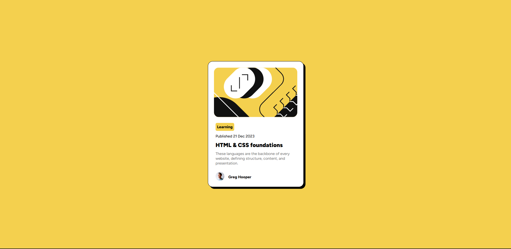

# Frontend Mentor - Blog preview card solution

This is a solution to the [Blog preview card challenge on Frontend Mentor](https://www.frontendmentor.io/challenges/blog-preview-card-ckPaj01IcS).

## Table of contents

- [Overview](#overview)
  - [Screenshot](#screenshot)
  - [Links](#links)
- [My process](#my-process)
  - [Built with](#built-with)
  - [What I learned](#what-i-learned)
  - [Continued development](#continued-development)
- [Author](#author)


## Overview

### Screenshot




### Links

- Solution URL: [My solution URL](https://www.frontendmentor.io/solutions/blog-preview-card-using-css-V9zkouza4B)
- Live Site URL: [My live site URL](https://zawadirapando.github.io/blog-preview-card/)

## My process

### Built with

- Semantic HTML5 markup
- CSS custom properties
- Flexbox

### What I learned

I learned:
- how to use the pseudo-class n-th child for easy access of elements under one parent. This made it easier to reference elements quickly. 
- how to properly center a div by making sure to use border-box, 0 padding and margin. This removes any excess padding and margins and ensures the true sizing is applied across the whole page.
- how to use box shadow to add a horizontal and vertical shadow to a box element.
- how to use the hover attribute to change the color of text when the cursor hovers over it.
- how to change the type of cursor depending on what it is hovering over.

To see how you can add code snippets, see below:

```css
.card {
    box-shadow: 6px 6px;
}
```

```css
.pointer:hover{
    color: hsl(47, 88%, 63%);
}
```

```css
p:nth-child(3) {
    cursor: pointer;
}
```

### Continued development

I need to continue working on my sizing. I need to learn when to use the right unit of sizing i.e. em, rem, px, % and more about min-height and its unit vh and how it works. I need to do research on image sizing and how they behave in a div.

## Author

- Frontend Mentor - [@zawadirapando](https://www.frontendmentor.io/profile/zawadirapando)
